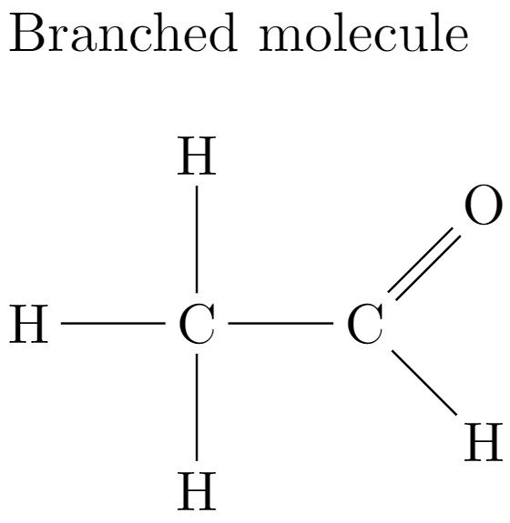

# 简单介绍
Latex是一套排版系统，可以通过纯文本(Plain Text)输入而输出高质量的文档或者印刷品。Latex系统最重要的特点是能生成复杂表格和公式，因此适用于编辑数学、物理等科技文档。

相比我们熟悉的Microsoft Word，用户可以通过选择文字，然后调整文字格式与缩进来控制整个文档的排版。Latex采用完全不一样的方法来控制文档的视觉效果：Latex指令(command)。Latex指令使用户专注于纯文本的编辑，系统会自动根据指令来展示相应的内容。以下列举生成化学式，数学公式的指令系统。

## 化学式

&#x20;Latex通过纯文本输入便可生成标准的化学结构式。把以下的文本输入Latex编辑器[Overleaf](https://www.overleaf.com/)便可以看到效果。

```tex
Branched molecule \vspace{.5cm}

\chemfig{H-C(-[2]H)(-[6]H)-C(=[1]O)-[7]H}
```




## 数学公式

数学公式是科技文献中不可或缺的部分。对于Latex来说，不管是多么复杂的公式都是小菜一碟。比如输入以下纯文本便可生成标准矩阵

```tex
\begin{bmatrix}
1 & 2 & 3\\
a & b & c
\end{bmatrix}
```

$$
\begin{bmatrix}
1 & 2 & 3\\
a & b & c
\end{bmatrix}
$$


再比如输入以下文本可生成复杂的表达式

```tex
\iiiint_V \mu(t,u,v,w) \,dt\,du\,dv\,dw
```

$$
\iiiint_V \mu(t,u,v,w) \,dt\,du\,dv\,dw
$$

还有一些应用里用Latex生成物理电路图，音乐五线谱，中国象棋的。
