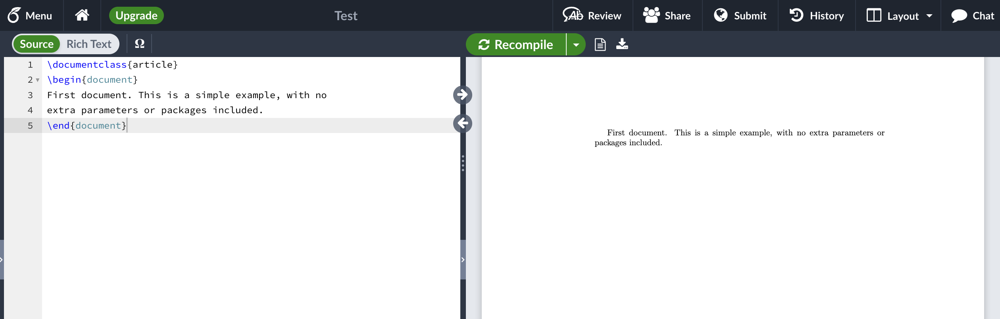

# 安装使用

## 在线Latex编辑器

Wikibook有推荐几款在线的编辑器，对于个人用户是免费的。

* [Authorea](https://authorea.com/)&#x20;
* [CoCalc](https://cocalc.com/doc/latex-editor.html)
* [Overleaf](https://www.overleaf.com/)

## 简单的案例

通过在线Latex编辑器Overleaf创建一个项目，然后输入以下指令。

```latex
\documentclass{article}
\begin{document}
First document. This is a simple example, with no 
extra parameters or packages included.
\end{document}
```

编辑好之后点击编译，输出结果如下图：

<figure><figcaption></figcaption></figure>

可以注意到：

* `\documentclass{}`, `\begin{}`这样带有`\`的为Latex指令。
* `\documentclass{article}`为文件类型。如果要编辑中文的文档，文件类型要改为`\documentclass{ctexart}`。[CTAN](https://www.ctan.org/topic/class)(Comprehensive TeX Archive Network)提供了所有的文件类型。
* 设置文档类后，内容写在 `\begin{document}` 和 `\end{document}` 标记之间。

以上全是最简单的Latex文本结构，`\documentclass{article}`, `\begin{document}` 和 `\end{document}`这三个指令/标签缺一不可。

