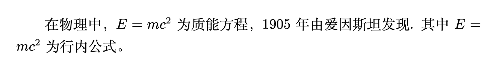
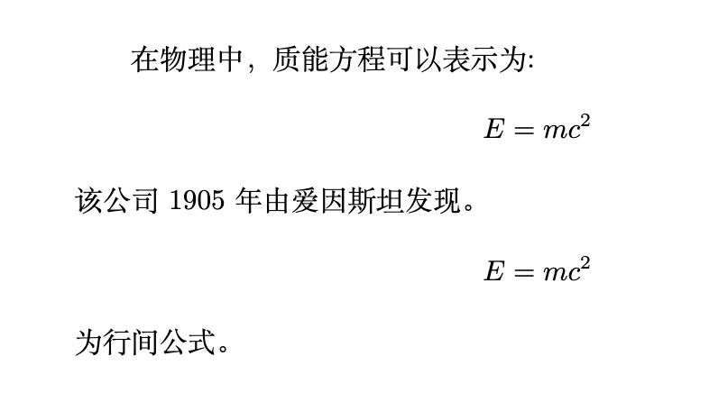

# 数学公式

LATEX 提供了两种数学公式的形式：

* 行内公式：公式嵌入在行内（Inline mode）
* 行间公式：公式独占一行或者几行（Block mode）

## 行内公式

```tex
\documentclass{ctexart}
\begin{document}
在物理中， $E=mc^2$ 为质能方程，1905年由爱因斯坦发现. 其中$E=mc^2$ 为行内公式。
\end{document}
```

以上行内公式的输出结果如下：



行内公式需要使用定界符`$......$`，定界符中间的文本会生成行内公式。同行效果的定界符有：`\( ... \)`, `$ ... $` or `\begin{math} ... \end{math}`

## 行间公式

```tex
\documentclass{ctexart}
\begin{document}
在物理中，质能方程可以表示为:
$$
E=mc^2
$$
该公司1905年由爱因斯坦发现。
$$
E=mc^2
$$
为行间公式。
\end{document}
```

以上行间公式的输出结果如下：



行间公式需要使用定界符`$$......$$`，定界符中间的文本会生成行间公式。同行效果的定界符有： `\[ ... \]`, `\begin{displaymath} ... \end{displaymath}` or `\begin{equation} ... \end{equation}`.&#x20;

**需要注意**

* **行内公式与行间公式定界符的差异。**
* **行间公式尽量避免使用定界符`$$......$$`，优先使用定界符有： `\[ ... \]`。原因可参考**[**Wikibook**](https://en.wikibooks.org/wiki/LaTeX/Mathematics)****
