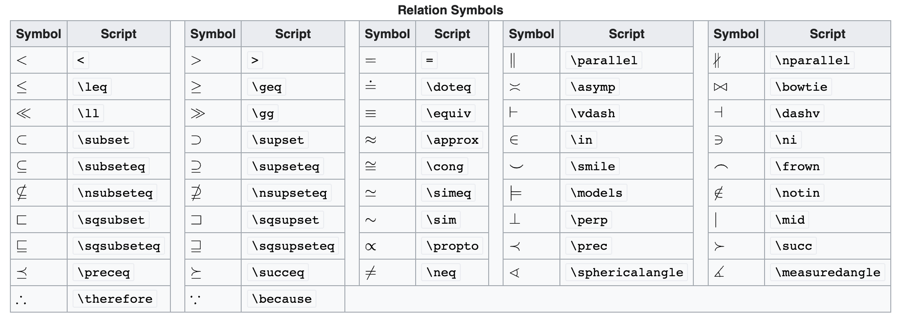

# 符号

数学有很多符号。以下是一组可以直接从键盘访问的符号：

```
+ - = ! / ( ) [ ] < > | ' : *
```

即最基本的加、减、括号、冒号等。

除了上面列出的那些之外，Latex可通过不同的命令显示希腊字母、集合关系符号、箭头等符号。比如输入

```tex
\documentclass{ctexart}
\begin{document}

$\forall x \in X$

\end{document}
```

$$
\forall x \in X
$$

`$\forall x \in X$`中，`$...$`为行内公式的定界符。后面文档忽略Latex的固定格式与公式的定界符，只保留Latex公式的指令。比如以上案例简化为：

```
\forall x \in X
```

输出结果为：

$$
\forall x \in X
$$

## 关系运算符

<figure><figcaption></figcaption></figure>

