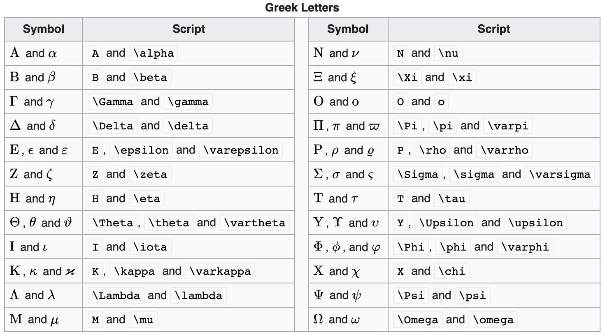

# 希腊字母

输入以下希腊字母的Latex指令

```tex
\alpha, \Alpha, \beta, \Beta, \gamma, \Gamma, \pi, \Pi, \phi, \varphi, \mu, \Phi
```

便可以生成相应希腊字母

$$
\alpha, \Alpha, \beta, \Beta, \gamma, \Gamma, \pi, \Pi, \phi, \varphi, \mu, \Phi
$$

其它希腊字母可参考下表：

<figure><figcaption></figcaption></figure>
